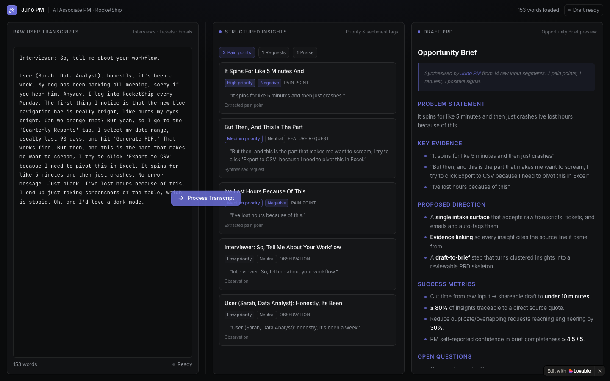

# Lovable Prototype · Juno

> The clickable prototype that puts the system prompt in front of a user.

## Prototype link

https://ai-pm-synthesis.lovable.app

The app loads with seeded demo text, so open it and paste a transcript to see the flow. It does not save state between visits, which is why the screenshot below is the record of the test run described further down.



## What it demonstrates

You paste a messy interview into the left column and press Process Transcript. The middle column fills with tagged insight cards. The right column writes an Opportunity Brief. It shows the whole raw to brief flow on one screen, without jumping between Slack, Notion and Jira.

## Prompts used

Built on the four part prompt anatomy: Role, Task, Format and Constraints, written as one block and pasted into Lovable in a single pass.

### Build prompt (Lovable, prompt 1)

```
Act as a Senior Frontend Engineer with 8+ years of experience shipping production React
dashboards for B2B SaaS products. You specialise in clean, dark-mode interfaces that
balance information density with breathing room.

Build a clickable three-column dashboard for 'Juno PM', an AI Associate PM at RocketShip.
Juno helps PMs synthesise messy raw inputs (interview transcripts, support tickets,
executive emails) into evidence-backed PRD drafts, replacing the chaos of jumping between
Slack, Notion, and Jira.

Three columns:
- LEFT, 'Raw User Transcripts': a large textarea where users paste interviews, tickets,
  and emails.
- MIDDLE, 'Structured Insights': cards with Priority and Sentiment tags, generated from
  the raw input.
- RIGHT, 'Draft PRD': a markdown preview pane showing a rendered Opportunity Brief.

Add a prominent 'Process Transcript' button between LEFT and MIDDLE that triggers a
loading state for 1.5s before populating the other two columns.

Rules:
- Use a dark-mode aesthetic with a single accent color for emphasis (no rainbow palettes).
- Three columns of equal width that don't reflow on a standard laptop screen (1280px+).
- Keep the 'Process Transcript' button persistently visible, never hidden behind a scroll.
- Do not add settings, configuration panels, login screens, or auth flows for V1.
- Do not add a sidebar or top navigation, go straight to the dashboard.
```

Where each element sits: **Role** is the senior frontend engineer with the dark mode
speciality. **Task** is the three column dashboard tied to RocketShip's actual bottleneck.
**Format** is the named columns plus the button and its loading state. **Constraints** are
the five rules, two of which are explicit "do not" instructions.

### Refine prompt (Lovable, prompt 2)

Vibe match rather than brand match, because the V1 was already dark with a single accent
and Linear uses the same idiom.

```
Refine the dashboard UI to match the aesthetic of Linear. Use their specific color
palette, border styles, typography, and spacing to make Juno feel like it belongs in that
ecosystem. Keep the three-column layout and the Process Transcript button intact.
```

Two prompts total, which kept me inside the Lovable free tier limit. Naming what to keep
intact mattered: the palette changed and the layout did not.

## Test run

I pasted the Sarah interview from the lab into the left column and pressed Process. She is a data analyst at RocketShip. Buried in her transcript is one real problem: the CSV export on the Quarterly Reports tab spins for about five minutes and then crashes with no error, so she loses hours and screenshots tables instead. Around it sits noise about a bright blue nav bar, a dark mode wish, and her dog barking.

## Debrief

- **What worked:** The prompt did exactly what I asked. Three equal columns that do not reflow, the Process button always visible, no nav bar, no login screen, dark mode with one accent color. The output looks like real PM work. Every card has a priority tag, a sentiment tag and the quote it came from. One follow up prompt was enough to move the whole thing to a Linear style palette without breaking the layout.

- **What broke / felt like a toy:** There is no real AI behind the button. I ran the same transcript twice in two different browsers and got identical output, so it is just splitting text on full stops. Because of that, one problem turns into three cards. Sarah complains once about the CSV export crashing, and Juno files it as a high priority pain point, a medium priority feature request, and a second pain point. The one quote that actually mentions Export to CSV is tagged Neutral, even though she says it makes her want to scream. The problem statement starts with "It" and never says what broke, so anyone reading only the brief has no idea. The interviewer's question became an insight card. The counts do not match the cards either. It says one praise, but there is no praise card on screen. The proposed direction and success metrics ignore Sarah completely and just describe Juno's own roadmap with made up numbers.

- **What I'd change next pass:** The UI is fine, so I would fix the system prompt instead. Group insights by root cause so one problem gives one card. Read sentiment from what the person actually says, not from where the sentence sits. Throw away interviewer questions and speaker labels before extracting anything. Make the problem statement name the thing that broke and how it broke. Do not let any number appear unless it comes from a quote. And seed the app with the test transcript on load, because right now a reviewer opening the link sees demo text rather than the run I am describing.

## The takeaway

The prototype looks convincing and gets the shape of the answer right, which is exactly what makes it dangerous. A stakeholder skimming the brief would walk away without learning that CSV export is broken. Nothing in the interface caused that. The failure is in the instructions, so that is where the fix has to go.
