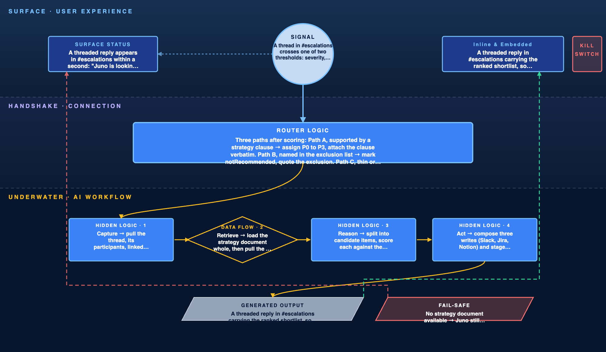

# AI-Native User Flow · Juno

> Juno's risk-prioritization flow as an iceberg. Seven nodes, each marked tip (the user sees it) or underwater (it runs unseen).

## Entry point

**Signal type:** Threshold crossed.

**Node 1 · Trigger, tip.** A thread in `#escalations` crosses one of two thresholds: severity, when it is tagged P0 or P1, or velocity, when it passes five messages within ten minutes. Either one fires the flow. Nobody opens Juno and nothing is pasted anywhere.

Two thresholds rather than one because severity tags are unreliable. Real incidents get argued about before anyone remembers to tag them, so the velocity bar catches the ones the tag misses. A single message never fires anything, which keeps Juno out of ordinary conversation.

**What they see instantly**

One threaded reply from Juno, posted within a second: "Reading this thread. Strategy last read 2 hours ago." The timestamp leads deliberately, so anyone in the thread knows which version of the priorities is about to be applied before they see a rank.

That single message is then edited in place as the work progresses and becomes the shortlist itself. One message per thread, never a sequence, because a bot that posts four times turns the thread it is trying to help into the thread nobody can read.

## The flow

**The handshake layer.** While nodes 2 to 5 run unseen, the message posted at the trigger is edited in place to show what is actually happening: "Reading the thread…" then "Checking against the Q3 strategy…" then "Counting affected customers…"

Each step corresponds to real work finishing, never a timer. If retrieval is slow, the step showing is the step running. A breadcrumb that lies is worse than none, because it teaches the PM to ignore the panel.

The whole sequence completes inside the four second retrieval budget, so the breadcrumbs read as progress rather than as an apology. Past four seconds the thread has moved on without Juno, which is the real deadline.

**Node 2 · Capture, underwater.** Pull the thread, its participants, any linked Jira keys, and the customer accounts named in it. Also pull the last 90 days of threads touching those same accounts, so a recurring problem is visible as recurring.

**Node 3 · Retrieve, underwater.** Load the strategy document whole, because its exclusion list only works if all of it is present. For each candidate item, retrieve from the indexed corpus with a Top-K of 8, using hybrid retrieval, then rerank the results.

Hybrid rather than semantic alone because the PM asks two kinds of question. Semantic search handles the conceptual one, what evidence says this is a reliability problem, since nobody writes "reliability problem" in a ticket. Keyword search handles the exact one, everything on ROCKET-4421 or everything Acme raised, since semantic search returns things that resemble a ticket number rather than that ticket. Every rank needs a theme and a receipt, so both run.

Top-K of 8 because ranking turns on how many separate customers are affected, and establishing that count takes two or three segments per item. Covering the top three items needs about eight. Fewer than six and a case resting on one customer stops looking thin. More than ten and cost per query climbs without surfacing anyone new.

Reranking because retrieval order is relevance order, and relevance is not authority. Strategy document first, then recency, then how many customers are affected. Without it a stale page can outrank the current strategy just by using similar words.

**Node 4 · Reason, underwater.** Split the thread into candidate items, one per distinct problem. Score each against the strategy. Count separate customers affected, ignoring message volume, so one account raising an issue twelve times counts once. Then route: supported by a clause gets a priority, named in the exclusion list gets marked not recommended, thin or contradictory evidence goes to the refusal path.

Routing turns on whether a clause matches, never on a numeric confidence cutoff. Testing showed the same input producing scores a few points apart between runs, so a rule like "under 30 is not recommended" would flip items across the boundary for no reason the PM could see. The clause either supports the item or it does not, and that answer is stable.

**Node 5 · Act, underwater.** Three writes are composed and staged, none executed:

- Slack: a threaded reply in `#escalations` carrying the ranked shortlist.
- Jira: a `juno-priority` field update plus a comment quoting the clause, on each matched ROCKET ticket.
- Notion: a row appended to the current week's prioritization page in the Product workspace.

Nothing lands until a person approves it. Juno drafts and the PM decides, so Act stages the work and stops.

**Node 6 · Surface, tip.** Two places, both where the work already happens.

The threaded reply in `#escalations`, edited in place from the status line into the shortlist, so everyone arguing in that thread sees the same ranking without leaving it.

And a shortlist card in the PM's Slack DM. Each row carries four things and nothing else:

- A priority badge. P0 to P3, or a struck-through notRecommended.
- The problem in one line, naming what broke.
- An evidence line reading "4 accounts, 2 enterprise", so the breadth behind a rank is visible without opening anything.
- A traceability footer quoting the strategy clause, linked to the thread or ticket it came from.

Approve, Edit and Reject sit on the card, not behind a menu.

No new dashboard. A ranking that lives somewhere people have to visit is a ranking they will not read during the argument it was meant to settle.

**Node 7 · Confirm / Correct, tip.** Approve executes the three staged writes. Edit changes a priority tag and asks for a one-line reason. Reject drops the item and asks why. Nothing writes to Jira or Notion until one of those three happens.

## AI moments

**Placement:** Inline and embedded, in Slack.

The value is augmentation rather than automation. The PM is not asking Juno to take the ranking away, only to stop building it from a blank page. So the output arrives inside the conversation that produced it, editable, rather than in a separate surface that would make reviewing feel like a second task.

**On the prototype.** The working build is a four column dashboard with a paste box, and that is deliberate. It is a test harness for the reasoning, not the shipping surface. Pasting a transcript by hand is the fastest way to check whether the ranking and the citations are right. Once that logic is trusted, the same engine moves to where the arguments actually happen, which is the thread, not a tool someone has to remember to open.

**Where the AI acts and what it shows.** Juno ranks and states the clause behind each position. The tag is what the PM acts on; the score is shown as an indicator, never as the claim, for the reason given at the Reason node.

Juno declines. Where a request is named in the exclusion list, Juno marks it not recommended and quotes the exclusion word for word. Never a paraphrase, because the PM needs to paste that wording straight into the thread where the decision gets challenged.

Juno refuses. Where evidence is thin, it says so rather than producing a rank.

**How the user stays in control.** Every item is editable in place and never read-only. The priority tag is a control rather than a label. One click reverts an item to what Juno produced, so an unwanted change costs nothing.

## Fallbacks

**Kill switch**

Reject on any item, or Reject All on the shortlist. Rejection stops the staged writes before anything reaches Jira or Notion, so a bad ranking costs one click and leaves no trace in the systems of record. The PM can also mute Juno on a specific thread when a conversation is not about prioritization at all.

**Training signal**

Every edit and rejection is logged with its one-line reason. An override within 30 seconds of the card arriving is logged as a fast correction, meaning Juno was obviously wrong rather than arguably wrong. Three fast corrections against the same strategy clause in a week flags that clause for review, because the pattern points at a scoring rule rather than a PM who disagrees. Approvals are logged too: a clause nobody ever overrides is one the scoring reads correctly.

**Fail-safe**

*Evidence is thin.* The row renders in amber with the badge reading "Unranked, needs evidence" rather than a priority, and carries Juno's refusal wording in place of a clause. It stays in the shortlist rather than disappearing, because an item that vanishes looks handled. Nothing gets a default priority, since a guessed rank is indistinguishable from a sourced one once it is in the list.

*Sources disagree.* Where a ticket and the strategy imply different priorities and reordering cannot settle it, Juno refuses and asks rather than choosing quietly. A silent pick is the worst failure here, because nothing on screen shows a judgment was made.

*No strategy document available.* Juno still ranks, on how well each request is put together rather than on what the company has decided. The whole card gets an amber header reading "Cautious mode, no strategy loaded" and every traceability footer is replaced with a prompt to load the document. Without the strategy the order can still be right, but the ability to decline anything is gone, and the card should look different enough that nobody mistakes one mode for the other.

*Retrieval or the model is unavailable.* Juno posts nothing rather than posting a guess, and tells the PM by DM that it skipped the thread. Silence in a channel is recoverable; a confident wrong ranking in front of the people arguing is not.

*The strategy changed but the index has not caught up.* Every ranking carries the strategy's last-read time, and Juno says so explicitly when that is older than the document. A confident refusal based on last quarter's exclusions is the most expensive failure here and the least visible.

## Self-review

- [x] Trigger is a real signal: a P0/P1 tag or five messages in ten minutes in `#escalations`, not "user opens app".
- [x] All seven nodes have one specific line each.
- [x] Tip versus underwater is marked on every node.
- [x] The Act node names specific tool calls: Slack threaded reply, Jira `juno-priority` field and comment, Notion weekly page row.
- [x] The Surface node names where: the `#escalations` thread and the PM's Slack DM.
- [x] At least one breadcrumb turns latency into transparency.
- [x] Every automated decision has a kill switch, and no write executes before approval.
