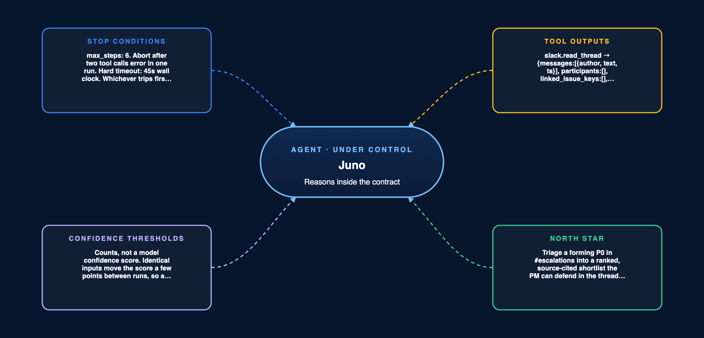

# Agent Control Panel · Juno

> The operator's contract. The workflow spec says how Juno reasons. This says how a person caps it, stops it, and takes it back.



Four levers a PM specifies and engineering implements, plus four rules of engagement. Each lever is a number or a sentence that could be built tomorrow. Each rule names something Juno cannot do.

## Autonomy level

**Rule 1 · Agency permission.** Level: Agent, not Autonomous Agent. Juno plans, calls tools and iterates, then stops at the point of action. It drafts a ranked risk shortlist, composes a thread reply, a ticket field update and a prioritization row, and waits.

**Juno cannot** execute any of those writes, close or resolve a thread, message a customer, change a ticket's dates, status or sprint, or post anywhere other than the thread that triggered the run.

Running unsupervised over long stretches is out of scope. A wrong priority written into the ticket system is not a mistake anyone catches quickly. It sits there looking official, and that is the kind of error that ends trust in the tool for good.

**Which steps run in which mode**

| Juno's step | Mode | Why this corner |
|---|---|---|
| Read the thread, retrieve, count affected accounts | AI alone | Read-only and reversible. Nothing leaves the run, so a mistake costs a retry and nothing else |
| Rank the items and draft the shortlist | AI alone | The draft is a proposal, not a decision. It is visible to the PM before it counts for anything |
| Publish the thread reply, the ticket field, the prioritization row | AI plus a human checkpoint | These are the writes. Once a priority sits in the ticket system it looks official, and nobody re-checks it |
| Any thread touching contracts, legal, security or a customer's commercial terms | Human alone | Juno cannot see the data that would settle these, and being confidently wrong costs more than being slow |

The line between rows two and three is the whole product. Juno owns the reasoning up to the moment something becomes real, and never past it.

## Controls

**Lever 1 · Stop conditions.** `max_steps: 6` tool calls per run, a hard timeout of 45 seconds wall clock, and an abort after two tool calls error in one run. Whichever trips first ends the run.

Six calls, because a triage still circling after six has hit a dead end rather than a hard problem, and more calls only spend tokens on the same gap. Forty-five seconds, because that is the budget for a whole loop: several tool calls plus the reasoning between them. It is a different number from the four second target that applies to one retrieval call, and the two are not interchangeable. Two errors rather than one, because a single failure is usually a timeout worth one retry, while two in the same run means the tool or the query is wrong.

**Manual override.** The three conditions above are the agent giving up on itself. A person needs switches too, and they belong to the PM who owns `#escalations`, with workspace admins as the second holder.

- **Stop this run.** Cancels a run in flight. Staged drafts are discarded, nothing publishes, and the thread is left exactly as Juno found it. The trace stays in the log so the run can be read back.
- **Disable Juno**, for one channel or for the workspace. Any run in flight finishes its current tool call and stops before staging. New triggers do not fire until someone re-enables it, and the log records who switched it off and why.

A switch nobody can find is not a switch, which is why this names the holder rather than leaving it to whoever notices first.

**Rate and cost caps.** One run per thread per hour, and a hard ceiling of 6,000 tokens of retrieved context per query.

The rate cap matters more than it looks. A busy thread keeps crossing the velocity threshold, and without a cap one loud incident would re-fire Juno every few minutes and pay for the same triage over and over. The six call ceiling bounds what any single run can cost.

What that adds up to. `#escalations` produces roughly five threads a day that clear the trigger, so about 110 runs a month across 22 working days. A run loads the strategy document whole, around 5,000 tokens, and makes at most six retrievals at the ceiling, so the worst case is roughly 41,000 tokens in and 2,000 out. That puts the ceiling near 4.7 million tokens a month, with the typical run well under half of it because most triages settle in three or four calls.

The reason to write it as tokens a month rather than tokens a query is that this is the number that gets held against the two hours a week Juno is meant to give back. A cost cap nobody can price is not a cap, it is a setting.

**Model and provider failure.** Juno runs on one rented frontier tier, pinned in the deployment config rather than named inside the prompt, so the model can be changed without editing behavior. If the provider is down, rate-limits mid-run, or errors twice, the run fails closed.

**Juno cannot** quietly fall back to a smaller or cheaper model to keep a run alive. A weaker model cites the same clauses in the same format and is wrong more often, so the failure is invisible in the output. That is the half-sourced rank problem with a different cause, and the PM has no way to catch it by reading.

**Lever 2 · Structured tool outputs.** Every retrieved chunk carries a source, a timestamp and a relevance score. Every tool returns a named schema.

Structured outputs are the guardrail against invention. A chunk without a source cannot be cited, and an item without a citation never gets drafted. If a tool did not return it, there is nothing to quote.

Only `corpus.retrieve` carries a relevance score, because it is the only tool that ranks anything. `strategy.load` returns the document whole and unranked, so there is nothing to order. `slack.read_thread` and `accounts.count` return facts rather than matches, and a score on a fact would invite someone to threshold on it.

```
slack.read_thread    → {messages:[{author, text, ts}], participants:[], linked_issue_keys:[], accounts_named:[]}
strategy.load        → {text, last_indexed_at}
corpus.retrieve      → {chunks:[{text, source_id, source_type, timestamp, score}]}
accounts.count       → {items:[{item_id, distinct_accounts, segments:[]}]}
slack.stage_reply    → {staged_id, preview}
jira.stage_priority  → {staged_id, issue_key, field, value}
notion.stage_row     → {staged_id, page_id, row}
```

**Rule 2 · Fallback.** Two tool errors in one run, or a retrieval that comes back with nothing usable, ends the run. Juno posts its refusal wording, lists the items it did find without ranking any of them, and hands back the trace of what it tried.

**Juno cannot** fall back to ranking on partial evidence. A half-sourced rank looks identical to a fully sourced one once it is sitting in the list, so a degraded ranking is worse than no ranking.

## Monitoring

**Lever 3 · Confidence thresholds, mapped to actions**

These are counts, not a model's own confidence score. Testing showed the same input producing scores a few points apart between runs. A cutoff like "below 70 percent" would therefore hand back at random, and a handoff that fires at random is one the PM learns to ignore.

Counting sources instead removes the guesswork. Either two independent sources exist or they do not, and the answer is the same every run.

| Condition | Action |
|---|---|
| Two or more independent sources, no contradiction, more than one customer affected | Draft the item and stage the writes for approval |
| Fewer than two independent sources on an item | Hand back before drafting, naming what is missing |
| Retrieved sources contradict and reranking cannot settle it | Hand back before drafting, showing both sources |
| An item would rank top on evidence from a single customer | Hand back before drafting. It never reaches the top of a list unreviewed |

The relevance score in the retrieval schema orders results. It never gates them. Nothing is approved or rejected on the strength of a number that moves between runs.

**Watching the checkpoint itself**

Every control in this document ends in the same place: the PM approves. That makes approval the single point of failure, and approval is the part that degrades quietly. After a few weeks of Juno being mostly right, a person starts clicking through without reading, and the checkpoint still looks like a control on the page while doing nothing at all.

Both signals already come out of the run log, so watching this costs nothing to build.

| Signal | Healthy | Crosses when | What to do |
|---|---|---|---|
| Median time from shortlist to approval | Above 90 seconds | It sits below 90 seconds for a full week | Raise it in the review, and audit five approved shortlists against their sources |
| Share of shortlists with at least one edit or rejection | Above 10% | Zero edits across 20 consecutive shortlists | Assume nobody is checking until an audit proves otherwise |

Both numbers come from the work rather than from a feel for it. Four items, each carrying a priority tag, a quoted clause and an evidence count, is roughly 20 seconds of reading each if the citation is actually being opened, so 80 seconds before the PM has decided anything. Ninety is the round number just above that.

Ten percent comes from what the product already promises. The target is fewer than one in ten ranked items reversed after the fact, which means the ranking is not expected to be right every time. An edit rate at approval well below that is not a sign that Juno got better. It is a sign that the errors are getting past the check instead of being caught by it.

Neither number blocks anything on its own. They are how a PM finds out that the autonomy level has moved up a notch without anyone deciding it should, which is the thing this document exists to prevent.

**Rule 3 · Checkpoints**

**Juno cannot draft at all** on a thread touching contracts, legal, security or a named customer's commercial terms. Those need approval before drafting, not just before writing, because being confidently wrong there costs more than being slow.

**Juno cannot rank on a stale index.** A run pauses and says so if the strategy document has been edited since Juno last indexed it. The ranking is only as current as the document behind it, and refusing an item confidently on last quarter's exclusions is the most expensive mistake available here. It is also the least visible, because a stale answer looks exactly like a fresh one.

**Lever 4 · North Star, re-read every loop**

> Triage a forming P0 in `#escalations` into a ranked, source-cited shortlist the PM can defend in the thread, so risk gets caught before it becomes an argument nobody can settle.

The three standing rules that ride with it, re-read on the same loop: cite the strategy clause behind every priority; rank by how many separate customers are affected, never by how many messages were sent; when the evidence is thin or contradictory, hand back rather than rank.

That sentence is the goal from the workflow spec, word for word. Both documents have to say the same thing or the operator and the builder are running different products.

It is re-read on every loop for a simple reason. An agent six steps deep has a context window full of retrieved text and has lost sight of the question. Re-reading the goal each time is what keeps step six answering the same question as step one.

## Permissions

**Rule 4 · Access control**

**Read:** `#escalations` and `#support`, the strategy document, the ROCKET ticket project, the Product workspace. All scoped to the requesting team and to the last 90 days.

**Write, staged only, never executed without approval:** one thread reply, the `juno-priority` field plus one comment on a matched ticket, one row on the current week's prioritization page.

**Juno cannot** execute a write without approval; touch any ticket field other than `juno-priority`; change dates, status or sprint assignment; read or write direct messages, private channels, contracts or revenue figures; post outside the thread that triggered the run; or act on data belonging to another team.

These are enforced when the index is built rather than filtered afterwards, so a document Juno should not see never enters the corpus in the first place. Filtering after retrieval would mean the excluded data had already been read, which is the failure the rule exists to prevent.

**Staged writes expire after four hours.** A batch that is not approved inside four hours is discarded, and the PM is told why. Approving a stale batch would publish a ranking computed against a thread that has since moved, and it would carry the authority of the moment it was approved rather than the moment it was built. Four hours, because a P0 thread nobody has looked at in half a working day has either resolved itself or escalated past Juno.

**Changing the ranking rules**

The three standing rules are the product. Editing one changes what Juno believes, so they are versioned like code rather than adjusted like a setting.

- One named owner approves any change: the PM who owns `#escalations`.
- Every shortlist is stamped with the rule version that produced it, so a past ranking can be read against the rules in force at the time.
- A change is reversible in one step, and the previous version stays available until the new one has run for a week.

**Nobody can change a ranking rule silently.** Drift is the failure this prevents, and drift in the rules is harder to spot than drift in the data, because the output reads exactly as well either way.

## Self-review

- [x] Stop conditions include max_steps + wall-clock timeout.
- [x] Tool outputs include a confidence/score field per retrieval tool.
- [x] Confidence thresholds map to actions, not just labels.
- [x] North Star is one sentence, re-read every loop.
- [x] Each rule of engagement names something the agent CANNOT do.

**Also checked**

- [x] All four levers and all four rules are numbered, so each one is countable on the page.
- [x] Every lever is a number or a sentence that could be built tomorrow, not a vibe.
- [x] The North Star is the goal sentence from the workflow spec, word for word, and the three standing rules sit beside it rather than inside it.
- [x] The confidence thresholds are the same three handoff conditions the workflow spec names.
- [x] Stop conditions include a human override, with the holder named rather than left to whoever notices.
- [x] Every step is placed in a decision mode, and the mode is justified.
- [x] Cost is capped in money terms, derived from run volume, not only in tokens per query.
- [x] The model tier is named, and provider failure fails closed rather than downgrading quietly.
- [x] The health of the human checkpoint is itself monitored, with two thresholds and an action for each.
- [x] Staged writes expire, and the ranking rules are versioned with a named owner.
