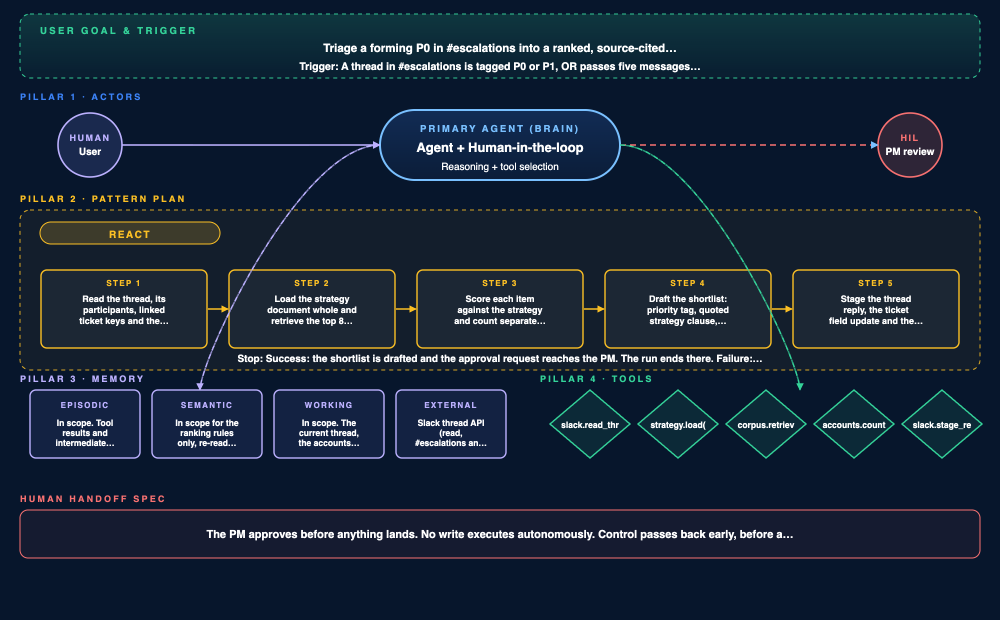

# Agent Workflow Spec (AWSpec) · Juno

> The contract for Juno's P0 triage agent: what starts it, how it reasons, what it may touch, and when it hands back.



## Goal

Triage a forming P0 in `#escalations` into a ranked, source-cited shortlist the PM can defend in the thread, so risk gets caught before it becomes an argument nobody can settle. The value frame is risk mitigation first and cost reduction second: the weekly prioritization review drops from two hours to thirty minutes as a side effect of the ranking already being built.

**Primary actor:** the agent, with the PM in the loop.

Juno pilots the triage. It decides what to retrieve, how to score, and what to draft. It does not pilot the outcome. Every write is staged and executes only on approval.

This is the highest autonomy level appropriate here. An agent that plans, calls tools and iterates fits the job. One that operates unsupervised over long horizons does not, because a wrong priority published into Jira is not a mistake anyone catches quickly and it is the kind that ends trust in the system permanently.

The technical approach call behind Juno ruled out going agentic, on the grounds that ranking needs retrieval and ordering rather than tool calls, and that every tool Juno could call is a tool that can write. That reasoning still holds for unsupervised action, and this spec does not overturn it. What it narrows is the second half: the tools here compose writes and never execute them, so the objection to tool-calling turns out to be an objection to tool-calling without a gate. This is the gated version.

## Trigger

A thread in `#escalations` crosses one of two thresholds:

- **Severity:** the thread is tagged P0 or P1.
- **Velocity:** the thread passes five messages within ten minutes.

Either one fires a run. A single message never fires anything, and a thread fires at most once an hour, so one loud incident cannot re-trigger the same triage every few minutes.

Two thresholds rather than one because severity tags are unreliable. Real incidents get argued about before anyone remembers to tag them, so the velocity bar catches what the tag misses.

Five messages in ten minutes is where an ordinary question stops looking like an incident. A normal question in that channel draws one or two replies and ends. Five inside ten minutes means at least three people have joined and are still typing, which is the shape of a problem forming. A lower bar would fire on every busy conversation and the PM would mute the bot within a week.

## Steps & tools

**Inputs, the context a run requires**

- The thread: channel, thread timestamp, every message in it, the participants, any linked ticket keys, and the customer accounts named.
- The strategy document, current version, loaded whole, with the time it was last indexed.
- The indexed corpus over Slack, tickets and the product workspace, scoped to the requesting team and to the last 90 days. A priority argued on evidence older than a quarter is arguing about a product that has already moved on.
- The account map, so a participant or a ticket can be resolved to the customer it belongs to. Without it, counting separate customers is guesswork.
- The model itself: one rented frontier tier, pinned in the deployment config rather than named inside the prompt, so the model can be changed without anyone editing Juno's behavior.

If the strategy document fails to load, the run does not start. Every priority has to quote a clause, so a ranking produced without the document would be an ordering with nothing behind it, and it would look exactly like a sourced one.

**Pattern:** ReAct.

Reason, act, observe, loop. Retrieval here is iterative by nature. Juno cannot know it needs a second retrieval until the first one comes back holding a single source, or two sources that disagree. A planner would have to commit to a retrieval plan before seeing any evidence, and settling evidence is the entire job.

Planner-Executor becomes the right choice if this ever runs across every escalation channel at once, because the work then splits into branches that genuinely do not depend on each other. That is not this spec.

| Step | Action | Tool | Guardrail |
|---|---|---|---|
| 1 | Read the thread, its participants, linked ticket keys and the customer accounts named in it | `slack.read_thread` | Read-only, and only in `#escalations` and `#support` |
| 2 | Load the strategy document whole and retrieve the top 8 corpus segments per candidate item, then rerank strategy first | `strategy.load`, `corpus.retrieve` | Every chunk returns a source and a timestamp, or it cannot be cited |
| 3 | Score each item against the strategy and count separate customers affected | `accounts.count` | Message volume is ignored, so one account raising an issue twelve times counts once |
| 4 | Draft the shortlist: priority tag, quoted clause, evidence count per item | model only | No item is drafted without a clause to quote |
| 5 | Stage three writes and request approval | `slack.stage_reply`, `jira.stage_priority`, `notion.stage_row` | Staged only. Nothing executes without approval |

**Tool inventory**

```
slack.read_thread(channel, ts)          read-only, #escalations and #support only
strategy.load()                          read-only, returns the document whole, never chunked
corpus.retrieve(query, k=8)              read-only, hybrid search, reranked strategy first
accounts.count(items)                    read-only, distinct customers per item
slack.stage_reply(thread_ts, payload)    write, staged, approval required
jira.stage_priority(issue_key, payload)  write, staged, approval required, one field and one comment
notion.stage_row(page_id, payload)       write, staged, approval required
```

**Schemas**

```
slack.read_thread    → {messages:[{author, text, ts}], participants:[], linked_issue_keys:[], accounts_named:[]}
strategy.load        → {text, last_indexed_at}
corpus.retrieve      → {chunks:[{text, source_id, source_type, timestamp, score}]}
accounts.count       → {items:[{item_id, distinct_accounts, segments:[]}]}
slack.stage_reply    → {staged_id, preview}
jira.stage_priority  → {staged_id, issue_key, field, value}
notion.stage_row     → {staged_id, page_id, row}
```

Every retrieved chunk carries a source and a timestamp, not just text. A chunk without a source cannot be cited, and the citation is the whole product.

Eight segments per item, because ranking turns on how many separate customers are affected. Establishing that count takes two or three segments per item, and covering the top three items needs about eight. Below six, there is not enough retrieved to show how narrow a case is, so an item resting on one customer reads as solidly as one resting on five. Above ten, the cost per query climbs without surfacing anyone new. The strategy document is loaded whole rather than retrieved, because its exclusion list only works if all of it is present.

**Memory, in or out of scope**

- **Episodic:** in scope. Tool results and intermediate reasoning within one run: which segments came back, what scored where, what was routed to escalation. Lifetime ends with the run, so a bad retrieval cannot poison the next thread.
- **Semantic:** in scope, but only for the ranking rules. Three of them, re-read every loop: cite every claim, group by root cause, rank by separate customers rather than message volume. The rules carry a version, and the version that produced a shortlist is stamped in its log, so any ranking can be read back against the rules in force when it was made.
- **Semantic, out of scope on purpose:** Juno does not keep customer contract terms, revenue figures, or any learned view of which accounts matter. Those are the facts that quietly turn into bias over a few weeks. The ranking is supposed to come from the strategy document, not from an opinion the agent has built up about who complains loudest.
- **Working:** in scope. The current thread, the accounts named in it, the strategy document held whole, and the retrieved segments for the item being scored. Context only, for the length of the run.
- **External:** the Slack thread API, the strategy document, and the corpus index over Slack, tickets and the product workspace. All read. The three write tools stage rather than execute.

**Read and write boundaries**

Juno can **read** `#escalations` and `#support`, the strategy document, the ROCKET ticket project and the Product workspace, all scoped to the requesting team.

Juno can **stage writes** to one thread reply, the `juno-priority` field plus one comment on a matched ticket, and one row on the current week's prioritization page.

Juno **cannot** execute any write without approval, touch ticket fields other than `juno-priority`, change dates or sprint assignment or status, read or write direct messages, private channels, contracts or revenue figures, or post to any channel other than the thread that triggered the run.

These match the access boundaries already committed in the requirements, where contracts, revenue and private channels are excluded from the index rather than filtered out afterwards.

## Human-in-the-loop

The PM approves before anything lands. Nothing publishes autonomously.

Control passes back early, before a draft exists, in three cases:

1. An item supported by fewer than two independent sources.
2. Retrieved sources that contradict each other and reranking cannot settle it.
3. Any item that would rank top on evidence from a single customer.

These are countable conditions rather than a model confidence score. Testing showed identical inputs producing scores a few points apart between runs, so a numeric cutoff like "below 70 percent" would hand back at random and teach the PM to ignore the handoff.

## Success & failure

**Done when** the shortlist is drafted and the approval request reaches the PM. The run ends there. Approval is a separate action, not part of this run.

**Fails when** two tool calls error in one run, or retrieval returns nothing usable. Juno posts its refusal wording and stops rather than drafting around the gap.

Two errors rather than one, because a single failure is usually a timeout worth one retry. Two in the same run means the tool or the query is wrong, and retrying past that spends the loop ceiling on the same failure.

**Escalates when** any of the three handoff conditions above fires, before a draft exists.

**Loop ceiling:** six tool calls per run. Past six the agent has stopped converging, which is a dead end rather than a hard problem, and continuing only spends tokens.

**Timeout:** 45 seconds wall clock. This is a different budget from the four second retrieval target committed in the requirements. That figure is the p95 for a single retrieval call; this one covers several calls plus reasoning. Conflating them would either break the retrieval spec or make the loop impossible.

**What the thread sees while a run is in flight.** Nothing. The 45 seconds are silent on purpose, because a placeholder posted into a thread where people are already arguing adds noise to the thing it is trying to settle.

If the thread gains more than ten new messages during a run, the run is discarded rather than surfaced. A shortlist built on the first half of an argument will be read as a summary of all of it, and being confidently out of date is the failure this whole design is trying to avoid.

**Fails safe by** staging every write rather than executing it. A wrong ranking costs one rejection and leaves no trace in the systems of record. If a tool fails, the run stops and says so rather than substituting a guess, because a plausible rank built on a failed retrieval is indistinguishable from a sourced one once it is in the list.

**Named failure modes and their handling**

| Failure mode | Handling |
|---|---|
| Hallucinated tool call | The inventory above is the whole surface. Anything outside it is rejected before execution |
| Memory poisoning | Episodic memory dies with the run. Semantic memory holds rules, never facts about accounts |
| Runaway loop | Six tool calls, 45 second wall clock, whichever comes first |
| Silent handoff failure | The three handoff conditions are countable, so a missed escalation is visible in the log rather than a judgment call |
| Drift across sessions | Nothing customer-specific persists between runs. The ranking rules that do persist are versioned, and the version is stamped on every shortlist |
| Provider outage or rate limit | The run fails closed. No quiet downgrade to a smaller model, because a weaker ranking cites the same clauses and is wrong more often, which the output cannot show |

**Eval hooks, what every run logs**

Per run: the run id, which trigger fired and whether it was the tag or the velocity threshold, the thread id, how many tool calls were used, and the wall clock. A run ends one of three ways, and the log says which: drafted, refused, or handed back. If it handed back, the log names which of the three conditions caused it.

Per drafted item: the priority tag, the source ids retrieved, the strategy clause quoted, and the count of separate customers affected.

After approval: what the PM did with each item. Approved as drafted, edited, or rejected, and the edited value where it changed.

The scores are deliberately not the thing being logged as a result. Identical inputs move them a few points between runs, so a log of scores would measure noise. The tag, the cited clause and the account count hold still, which makes them checkable. The PM's edit is the only ground truth this product gets, and it arrives for free every time someone approves a shortlist, so it is worth capturing from the first run rather than fitted later.

**The trade-off being made:** accuracy bought at the cost of latency. Loading the strategy whole, retrieving eight segments, reranking, then counting distinct customers all add time. A triage that takes 45 seconds and cites its sources is worth more than one that answers in five and cannot be defended, because the whole point is surviving the argument in the thread.

## Self-review

- [x] Goal is one sentence and names the value frame.
- [x] Trigger is a precise, testable condition.
- [x] Pattern is chosen with a defensible reason.
- [x] At least 3 stop conditions, including escalation.
- [x] Each memory type named (in or out).
- [x] Every tool lists scope (read-only vs write) and a schema.
- [x] Read/write boundaries match the AI PRD.

**Also checked**

- [x] The value frame is ordered rather than listed: risk mitigation first, cost reduction second, with the time saving derived from the work it replaces.
- [x] Both trigger thresholds are derived, and the reason for two rather than one is stated.
- [x] The rejected pattern is named along with the condition that would make it the right choice.
- [x] Stop conditions go past the three required: success, failure, escalation, a loop ceiling and a timeout, each with the reason for its number.
- [x] Semantic memory names what is deliberately out of scope, not only what is kept, and the rules it does keep are versioned.
- [x] Inputs name the context a run requires, and what happens when a required input is missing.
- [x] Eval hooks name what every run logs, and why scores are not among the logged results.
- [x] The failure table covers all five named failure modes plus provider outage, and the model tier is named as an input rather than buried in the prompt.
- [x] The latency budget has a user-facing contract: what the thread sees during a run, and what happens when the thread moves on mid-run.
- [x] The trade-off being accepted is stated outright rather than left implicit.
