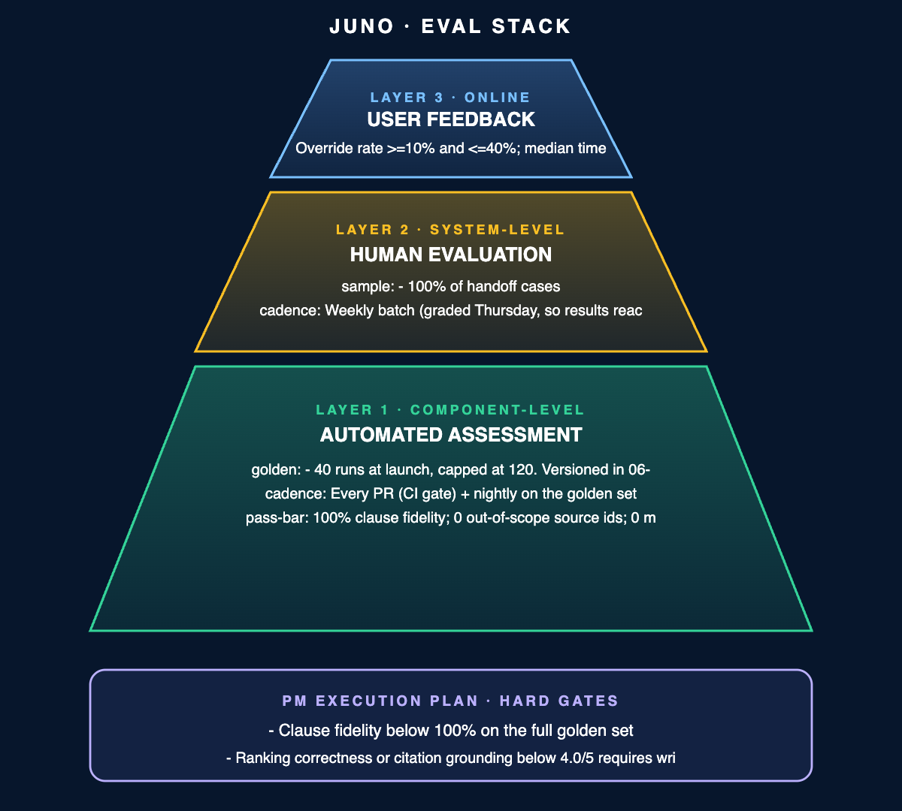

# Eval Stack · Juno

> Three layers, always all three. They answer different questions: whether a change broke something, what graders think, and what the PM actually does with the output.

## What "good" means

Override rate 10% to 40%; median time to approval >=90s; staged batch expiry <5%

- Active: the PM approves each item as drafted, edits it, or rejects it, and the edited value is recorded where it changed. A "not useful" control on the shortlist card captures the case where the whole run was noise.
- Passive: median time from shortlist to approval, staged batch expiry (a batch not approved within four hours is discarded), and the override rate itself, which needs nobody to submit anything.

**Accuracy is deliberately not one of the bars.** Juno emits a numeric score that moves a few points between runs on identical input, so a quoted accuracy figure would be a number nobody can act on. The three bars above are countable and each names its own fix.

The bands are two-sided on purpose. Below 10% override nobody is checking; above 40% Juno is not saving anyone time. A one-sided target rewards a copilot nobody corrects, which is this product's most likely failure and the one it is least equipped to notice.

Derivations. 10% is the committed target of fewer than one in ten ranked items reversed after the fact: overriding less often than that means errors are getting past the check rather than being caught by it. 40% is the point at which rewriting two drafts in five costs more than starting from a blank page. 90 seconds is four items at roughly 20 seconds of real reading each. 5% expiry is one shortlist in twenty going unread for four hours, where the trigger is selecting the wrong threads rather than the PM being busy.

## The stack

| Layer | Evaluator | What it catches | Threshold / gate |
|---|---|---|---|
| Code-based | Automated checks · cadence: Every PR (CI gate) + nightly on the golden set · owner: CI fails the PR. Eng owns the harness. PM owns the clause-fidelity bar. | - Clause fidelity: every quoted clause appears verbatim in the strategy document at the cited location - Source resolution: every source_id resolves inside #escalations, #support, ROCKET or the Product workspace - Refusal check: no item drafted on fewer than two independent sources, contradictory sources, or a single customer at the top - Counter reconciliation: summary counts equal the items rendered beneath them - Budget conformance: 6 tool calls, 45s wall clock, 6,000 tokens per query | 100% clause fidelity; 0 out-of-scope source ids; 0 missed refusal triggers; 0 counter mismatches |
| LLM-as-judge | Automated assessment on the golden set · 20 golden-set cases nightly, rotating so the full set is covered every two nights | Whether a clause that exists and is quoted correctly actually supports the rank it carries. This is the only check code cannot make, and it is the gap between a 3 and a 4 on citation grounding | >=90% agreement with the most recent human grading round on citation grounding |
| Human | 06-evals/human-rubric.md · 2 graders + PM tiebreak per disagreement protocol · cadence: Weekly batch (graded Thursday) · owner: PM who owns #escalations sets the bar and resolves tiebreaks | - Every handoff, 100% - 10 drafted runs / week - Stratified by separate customers affected on the top item (3 single / 4 two-to-three / 3 four-plus) | >=4.0/5 on ranking correctness, citation grounding and handoff correctness; 0 items scored 1 on handoff correctness or access safety |

**Clause fidelity is the one binary metric to automate first.** It is a string match against a known document, so it needs no model and cannot itself hallucinate, and it protects the whole product claim: an item whose citation does not hold is indistinguishable from one whose citation does.

The dimensions, anchors, sampling and disagreement protocol for the human layer are defined in `human-rubric.md` and are not restated or changed here. That layer is the calibration the other two depend on: the judge is scored against it, and the Layer 3 bands are only meaningful if the grading behind them is consistent.

## Golden set

- 40 runs at launch, capped at 120. Versioned in `06-evals/golden-set/`, alongside the ranking rules.
- Composition: 15 drafted shortlists spanning one, two-to-three and four-or-more customers affected; 9 handoffs, three per condition; 6 threads that must route for approval before drafting; 5 threads where the strategy document excludes the item; 5 regression cases from real failures.
- Assertions: the priority tag, the quoted clause, the source ids, and whether the run drafted or handed back. **Never the numeric score.**
- Maintenance: every PM tiebreak from the human layer is added as a case, with the resolution as the expected answer. Cases retire when the strategy clause they test is removed. Refresh after any incident Juno failed to surface.

40 at launch is what the composition above requires to cover every handoff condition and every routing path more than once. The cap exists because a golden set nobody prunes becomes a suite everybody skips.

Asserting on the score would produce a suite that fails at random and gets muted within a fortnight. The tag and the clause hold still, which is what makes them assertable. The set is versioned alongside the rules because a rule change moves the expected answer, and running the old set against new rules reports failures that are actually the change working.

## Release gate

**Hard gates (auto-block):**

- Clause fidelity below 100% on the full golden set
- Any source_id resolving outside the allowed scope
- Any item scored 1 on access safety in the latest human round
- Any item scored 1 on handoff correctness in the latest human round
- Any golden set case newly failing

**Soft gates (PM sign-off):**

- Ranking correctness or citation grounding below 4.0/5 requires a written justification or a hold
- Defensibility below 3.5/5 requires PM review
- A regression against 6 tool calls, 45s or 6,000 tokens requires PM justification, not an auto-block

**User-feedback layer (online):** cadence Continuous collection + weekly aggregate review; owner PM who owns `#escalations`; on-call PM is paged when override rate leaves the 10% to 40% band for a full week, or when median approval time drops below 90s.

Hard and soft split on one question: would anyone notice this failure without the eval telling them? A fabricated citation, an out-of-scope source and a missed handoff all look exactly like correct output. Latency and a weak ranking announce themselves, so a person can weigh them.

When a gate fails, pull the levers in order: prompt, then model, then data. Architecture last. Most of what this stack catches is an instruction failure, and rebuilding retrieval to fix a prompt problem is the slowest way to find that out.

## Self-review

- [x] All three layers have signals/checks specified.
- [x] Each layer has a numeric pass bar.
- [x] Each layer has a cadence.
- [x] Each layer names who acts on it.
- [x] Layer 2 references the human-rubric.md file.
- [x] Layer 3 has a versioned golden set.
- [x] At least one hard gate is defined.

**Also checked**

- [x] The user-feedback layer names one active mechanism and three passive ones.
- [x] One binary metric is named as the first to automate, with the reason it is that one.
- [x] The rubric's dimensions are referenced, never restated or modified.
- [x] Golden set assertions avoid the numeric score, because it moves between runs on identical input.
- [x] Every threshold is derived, including both ends of the two-sided bands.
- [x] Hard and soft gates are separated by one stated rule: whether the failure is visible without the eval.
- [x] The LLM-judge layer states what only it can catch, rather than repeating the code-based checks.
