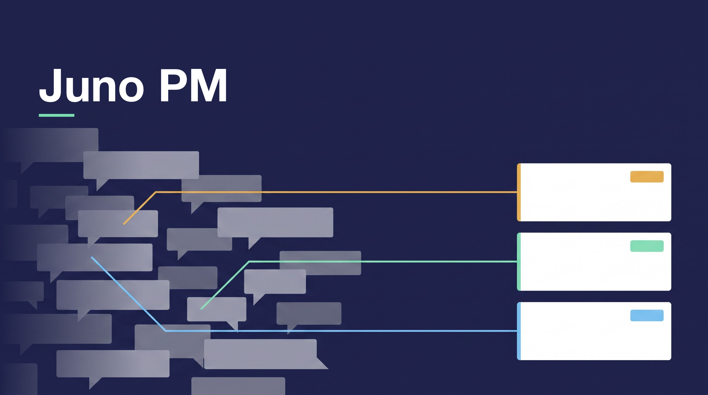
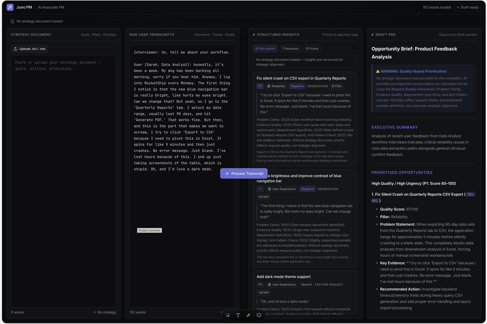
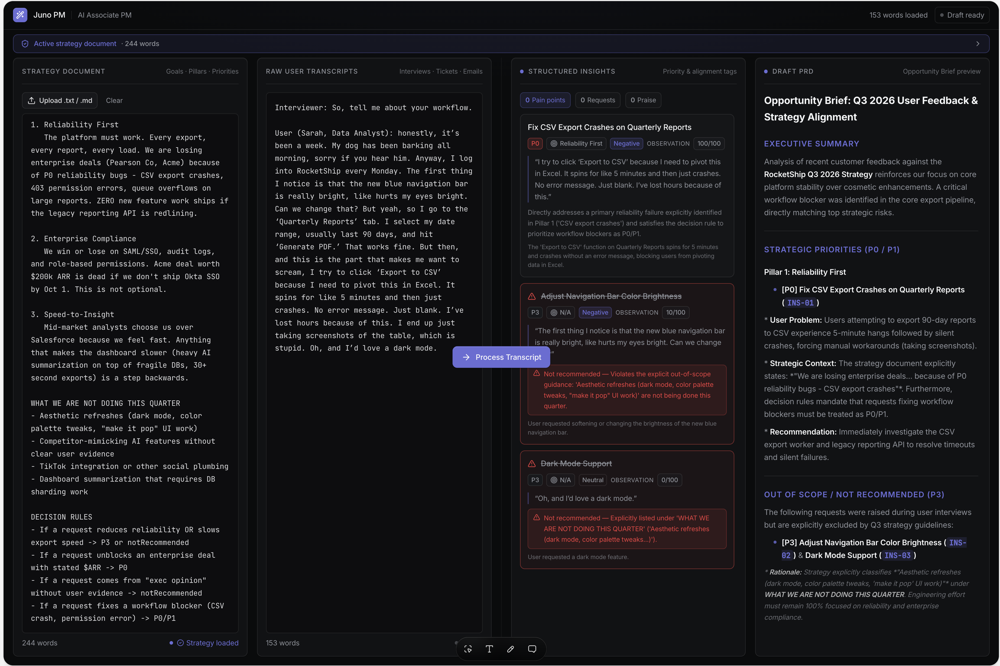

# Juno PM · AI Copilot for RocketShip's Product Org

> Juno PM turns RocketShip's flood of escalations, tickets and customer calls into a short, ranked, sourced list of what matters, so a product manager can decide quickly and defend the call afterwards.

_Antje Barth · AI Product Management Certification · Aug 2026 cohort_

Repo: https://github.com/antje/product-school-ai-product-management

This repo is my final project for the **AI Product Management Certification**. Each module's artifact lives in its own folder; this README is the dashboard and the pitch.

## The bet in three layers

**Strategy.** RocketShip's roadmap is ranked by whoever posted last and loudest. The PM cannot produce the evidence behind a rank inside the meeting, so decisions get reversed the week after. Juno's job is risk mitigation: make every priority defensible, with the source attached.

**Mechanic.** The first three modules built the ranking engine for the weekly review. Module 4 moved it. By the time the weekly review happens the loudest thread has already won, so the same ranking logic now runs inside the `#escalations` thread at the moment a P0 forms, where the evidence is freshest and the decision is still open. That shift is the one deliberate change of course in this repo.

**Implementation.** A rented frontier model grounded by RAG over RocketShip's own corpus, with the strategy document loaded whole so it can refuse. An agent that plans, calls tools and iterates, and executes nothing until a person approves. Three evaluation layers with hard gates on the failures nobody notices without them.

## The ask and the return

| | |
|---|---|
| **Ask** | One engineer for two sprints, plus the PM's own time. Sprint 1 builds the two blocking checks and the first 20 golden cases. Sprint 2 ships read-only into `#escalations`. Owner: the PM who owns the channel. The engineering estimate is the first number to confirm; the decision matrix flags it as an assumption rather than a quote. |
| **Run cost** | About 4.7M tokens a month at the ceiling. At a blended $5 per million tokens that is under $25 a month, and under $75 if the price triples. Assumption, to confirm against the provider contract. |
| **Return, priced** | Six PM hours a month from the review alone. Plus reversals: several a week today, under four a quarter at target, so roughly 25 avoided per quarter. If one in five reversals means an engineer started on the wrong item for a week, that is about five engineer-weeks a quarter recovered. Assumption stated, not measured. |
| **Return, not priced** | The value of a P0 caught a day earlier. It depends on ARR and contract exposure, which Juno is built not to see, so this document does not estimate it either. The reversal figure carries the case on its own. |
| **Kill** | Reversal rate flat while review time drops. That means provenance was never the constraint, and the cheaper ungrounded option was right all along. |

## The numbers that define Juno

Every figure below is derived in the file that owns it, not chosen.

| Number | What it is | Derived from |
|---|---|---|
| 2h → 30 min | Weekly prioritization time | ~40 items at ~30s each to check against a cited source, plus discussion |
| < 10% | Rankings reversed within a week | 10% of a 40-item backlog is four per quarter, about one a fortnight |
| P0/P1 tag, or 5 msgs in 10 min | Trigger | Three people typing inside ten minutes is the shape of an incident; one reply is a question |
| Top-K 8 | Segments retrieved per item | Two or three segments establish a customer count; the top three items need about eight |
| 4s p95 / 45s | Per retrieval call / whole run | Four seconds vanishes inside a 30s-per-item review; the loop is several calls plus reasoning |
| 6 tool calls | Loop ceiling | A triage still circling after six has hit a dead end, not a hard problem |
| 100% / 0 | Clause fidelity / out-of-scope sources | The two failures that look identical to correct output, so zero tolerance |
| 10% to 40% | Override rate, two-sided | Below 10% nobody is checking; above 40% Juno is not saving time |
| ≥ 4.0 / 5 | Human rubric pass bar | Below 4.0 the sample is producing rankings that will not survive the week |
| ~4.7M tokens / month | Cost ceiling | ~110 runs at ~41k tokens in; held against six PM hours a month returned |

---

## Module artifacts

### M1 · Prompting
Juno's job description as configuration: one job, named sources, nine rules and six refusals, a fixed output schema, and a worked example of the hardest case. Every rule traces to a specific failure the prototype produced, which is the argument for the pair. The prototype itself turned out to have no model behind it, byte-identical output on repeated runs, and that finding shaped how everything after it was tested.
- **System prompt**: [`01-prompting/system-prompt.md`](01-prompting/system-prompt.md)
- **Lovable prototype**: [`01-prompting/lovable-prototype.md`](01-prompting/lovable-prototype.md) · live at [ai-pm-synthesis.lovable.app](https://ai-pm-synthesis.lovable.app)

### M2 · Strategy
Build the evidence layer, rent the model. All three options rent a base model, so the real decision is where engineering effort goes, and the axis that decides it is provenance rather than cost. Autonomy stays at Copilot because the risk sits in the write action, not the draft. The scariest risk is Juno laundering opinion into evidence, mitigated by ranking on distinct customers affected rather than message volume.
- **Decision matrix**: [`02-strategy/decision-matrix.md`](02-strategy/decision-matrix.md)
- **AI Strategy one-pager**: [`02-strategy/strategy-one-pager.md`](02-strategy/strategy-one-pager.md)

### M3 · RAG / AI PRD
Hybrid retrieval, split two ways: the strategy document is read whole, because its exclusion list only works if all of it is present, and everything else is chunked by natural unit and retrieved at Top-K 8. Every rank shows a tag, a source and a quoted clause, or it fails the build. The finding that shaped the PRD: grounding did not change the order, it made refusal possible.
- **AI PRD**: [`03-rag-prd/prd.md`](03-rag-prd/prd.md)

### M4 · AI-Native UX
Slack-native, no new dashboard. A thread crossing a severity or velocity threshold fires the flow; one reply is posted and edited in place into the shortlist; every write is staged behind Approve, Edit and Reject. The three trust gaps are scored honestly, with control at 3 of 5 because Juno deliberately keeps no memory of which items a PM rejected, and the highest-priority fix respects that boundary rather than breaking it.
- **AI user flow**: [`04-ai-ux/user-flow.md`](04-ai-ux/user-flow.md) · [flow diagram](04-ai-ux/user-flow.png)
- **Trust-gap mitigations**: [`04-ai-ux/trust-gaps.md`](04-ai-ux/trust-gaps.md)
- **Prototype screenshots**: quality mode ranks on request quality alone; strategy mode declines with a cited exclusion clause.

| Quality mode | Strategy mode |
|---|---|
|  |  |

### M5 · Agentic Workflows
The gated agent. Module 2 ruled out going agentic; this is the version that objection allowed, tools that compose writes and never execute them. Handoff fires on countable conditions rather than a model confidence score, because identical inputs move the score between runs. The control panel adds what the spec cannot: a human kill switch with a named holder, cost in tokens per month, fail-closed on provider outage, and monitoring of the approval checkpoint itself, since every guardrail ends at a person who will eventually stop reading.
- **Agent Workflow Spec (AWSpec)**: [`05-agentic-workflows/awspec.md`](05-agentic-workflows/awspec.md) · [workflow diagram](05-agentic-workflows/awspec.png)
- **Agent Control Panel**: [`05-agentic-workflows/agent-control-panel.md`](05-agentic-workflows/agent-control-panel.md) · [control panel diagram](05-agentic-workflows/agent-control-panel.png)

### M6 · Evals & Guardrails
Three layers, each with a numeric bar, a cadence and an owner. The human rubric scores five distinct failures with 25 observable anchors. The eval stack's bands are two-sided, because a copilot nobody corrects is the likeliest failure and the least visible. Hard gates are reserved for the failures nobody would notice without the eval: a fabricated citation, an out-of-scope source, a missed handoff. Accuracy is not a bar.
- **Eval stack**: [`06-evals/eval-stack.md`](06-evals/eval-stack.md) · [stack diagram](06-evals/eval-stack.png)
- **Human evaluation rubric**: [`06-evals/human-rubric.md`](06-evals/human-rubric.md)

---

## PM Execution Plan

### Where Juno is today
- Eleven artifacts specced and committed, M1 through M6.
- The prototype is live at [ai-pm-synthesis.lovable.app](https://ai-pm-synthesis.lovable.app) and has been grounded in the strategy document since the M3 rebuild. It is a test harness for the reasoning, not the shipping surface.
- The agent is a specification. No tool call has run against live Slack, Jira or Notion.
- Golden set: 40 cases composed and allocated across handoff conditions and routing paths. None written yet.
- Human rubric: five dimensions, 25 anchors, pass bars set. No calibration round run, graders not staffed.
- Nothing is wired to CI. Closing that gap is the two-sprint ask above.

### What ships next (next 2 sprints)
- **Sprint 1, make the checks real.** Build clause fidelity and source resolution as blocking CI checks. Write the first 20 golden set cases, the 9 handoffs plus 11 drafted shortlists. Run one calibration round with 2 graders over 12 items and fix whichever anchors they read differently.
- **Sprint 2, read-only in production.** Juno posts the shortlist into `#escalations` behind a flag and stages nothing. Measure trigger precision, the share of fired runs the PM says was worth firing. No write scope is granted until that number holds, because a wrong write costs more than a wrong suggestion.

**Beyond two sprints: the other two pillars.** Juno's mandate is three jobs, and this repo builds one. Prioritize risks came first because it is the pillar where a wrong answer is visible fastest, in the thread, in front of the people arguing, and where the evidence corpus is already richest. Draft specs earns its place when the override rate has held inside the 10% to 40% band for a full quarter. The system prompt already knows how to draft a PRD when asked; earning its place means running unprompted and staged into Notion, the way the ranking now runs into the thread, and a spec is a larger write than a rank, so the same approval checkpoint has to be proven real before it carries more weight. Synthesize insights is last, not because it is hardest but because it is the pillar whose output nobody argues with in a room, so a wrong answer there stays wrong longest. Same lens each time: how visible is the failure, and how much does the write cost.

### What I watch (dashboards)
- **Daily:** handoff rate, run discard rate (the thread moved on mid-run), missed refusal triggers.
- **Weekly:** override rate, median time to approval, staged batch expiry, rubric mean per dimension.
- **Per release:** clause fidelity, out-of-scope source ids, golden set regressions, LLM-judge agreement with the last human round.
- **Monthly:** tokens per month against the 4.7M ceiling, and cost per run against the two hours a week Juno is meant to give back.

### Red lines (what blocks shipping, numbers not feelings)
- Clause fidelity below 100% on the full golden set.
- More than 0 `source_id` values resolving outside `#escalations`, `#support`, ROCKET or the Product workspace.
- Any item scored 1 on access safety in the latest human round.
- Any item scored 1 on handoff correctness in the latest human round.
- More than 0 golden set cases newly failing against the previous release.
- Override rate below 10% for a full week. That one is not a quality failure. It means the approval checkpoint has stopped working, and the other five only hold while it does.

### Governance
- **Compliance.** Contracts, revenue figures, direct messages and private channels are excluded when the index is built, not filtered after retrieval, so data Juno should not see never enters the corpus. Retrieval is scoped to the requesting team and the last 90 days.
- **Safety.** Every write is staged and executes only on approval. Threads touching contracts, legal, security or a customer's commercial terms cannot be drafted at all until a human approves.
- **Reliability.** Provider outage fails the run closed, with no silent downgrade to a smaller model. Six tool calls, 45 seconds wall clock, abort after two tool errors. A manual kill switch is held by the PM who owns `#escalations` and by workspace admins.
- **Reputation.** The ranking rules are versioned with a named owner and stamped on every shortlist, so any past ranking can be explained against the rules in force when it was made.

---

## Build Insights

- **Friction point.** I built Juno for the weekly prioritization review for three modules, then saw in the user flow that the review is where the argument has already been lost. The same ranking logic had to move into the `#escalations` thread, at the moment a P0 forms. That is the mechanic layer of the three-layer model, the one most PMs get wrong, and I got it wrong first. Admitting it cost more than any technical decision in this repo.
- **Key learning.** Convincing output is the failure mode, not the success signal. The first prototype looked finished and produced byte-identical output on two runs, so it had no model behind it. Later, every guardrail I wrote ended with the PM approving, and nothing checked whether the PM still read. Both times, what looked like control was not. Evals exist because working and convincing are indistinguishable from the outside.
- **Aha moment.** Quality mode could rank. Only strategy mode could decline. Grounding did not make Juno better at ordering evidence; it gave it the ability to say no and quote the clause. That is the one thing a PM cannot do from memory in front of leadership, and it turned Juno from a ranking tool into a refusal tool. Every hard gate in the eval stack follows from it.

---

_Certification submission, AI Product Management Certification._
